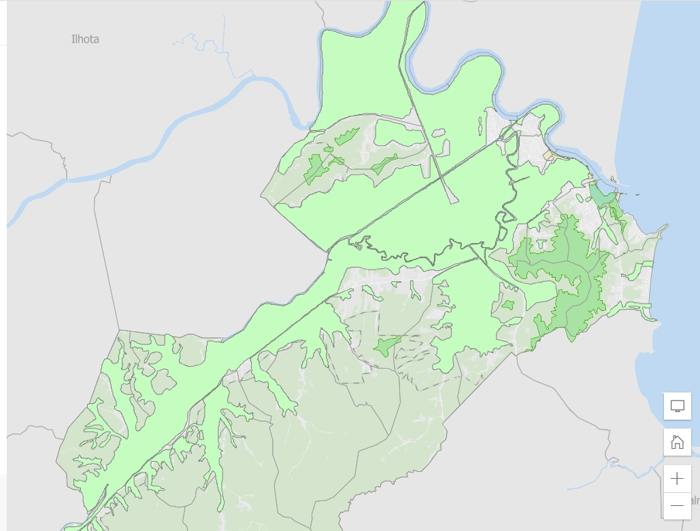
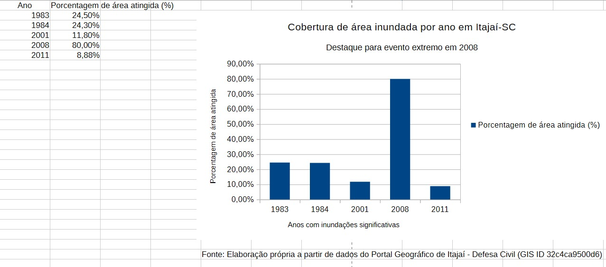

# Análise Geoespacial de Inundações - Itajaí SC

Estudo sobre as áreas atingidas pelas maiores cheias em Itajaí.

### Dados de Área Atingida

| Ano | Porcentagem de área atingida (%) |
| :--- | :--- |
| 1983 | 24,50% |
| 1984 | 24,30% |
| 2001 | 11,80% |
| 2008 | 80,00% |
| 2011 | 8,88% |

### Mapa da Área Inundada - 2008

*Mancha de inundação de 2008 - 80% do município atingido.*

### Gráfico: Cobertura por ano

### Fatores que Contribuíram - 2008

| Fator | Descrição | Impacto |
| :--- | :--- | :--- |
| Bloqueio Atmosférico | Alta pressão no Atlântico | Chuva parada 10 dias |
| Vórtice Ciclônico | 4000-5000m altitude | Intensificou chuva |
| Chuva Extrema | 1.100 mm em Out/Nov | 3 dias = 4 meses de chuva |
| Maré Alta + Lua | Ressaca da Argentina | Represou rio |
| Rio Itajaí-Açu | Subiu 11,52m | Cidade 7 dias inundada |

**Fonte:** Portal Geográfico Itajaí - Defesa Civil / EPAGRI / INPE / UDESC
